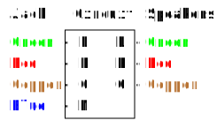

<!-- TODO: recheck everything -->
# WICO (Wiring Combinations)

### Table of Contents

* [Installation](#installation)
* [Usage](#usage)
* [Testing](#testing)
* [History](#history)
  * [Origin](#origin)
  * [Naive Solution](#naive-solution)
  * [Optimized Solution](#optimized-solution)
  * [Journey of Improvement](#journey-of-improvement)
* [Internals](#internals)
  * [File Structure](#file-structure)
  * [How it Works](#how-it-works)
  * [Permutations](#permutations)
  * [Combinations](#combinations)

## Installation
1. Check if Node.js is installed:
   ```bash
   node --version
   ```
2. Clone the repository:
   ```bash
   git clone https://github.com/PD-22/wico.git
   ```

## Usage
1. Open the project folder:
   ```bash
   cd ./wico
   ```
2. Run the application:
   ```bash
   npm start
   ```
3. Expected output:
   ```text
   Writing output to "output\wiring.txt"...
   DONE
   ```
4. Check the generated output in the specified location.
   ```txt
   #1:
     Jack:
       L - Green
       R - Red
       G - Copper
       M - Blue
     Speakers:
       L - Green
       R - Red -> Copper
       G - Copper -> Red
   ... (143 more combinations)
   ```

## Testing
To run all the test files in the test folder, you can use the following bash command:
```bash
find ./test/ -type f -name "*.js" -exec bash -c 'cmd="node {}"; echo "$cmd"; $cmd' \;
```
If you want to exclude the performance tests, which might take longer to execute, you can use the following command:
```bash
find ./test/ -type f -name "*.js" ! -name "performance.js" -exec bash -c 'cmd="node {}"; echo "$cmd"; $cmd' \;
```
For running only the performance tests, use the command below:
```bash
find ./test/ -type f -name "performance.js" -exec bash -c 'cmd="node {}"; echo "$cmd"; $cmd' \;
```

### Test types and output examples
1. Test file that contains a single test
   * Command:
      ```bash
      node test/src/combinations/array.js
      ```
   * Success output:
      ```txt
      PASS
      ```
   * Failure output:
      ```txt
      FAIL: Expected values to be strictly deep-equal:
      + actual - expected ... Lines skipped
      
      [
         [
      ...
            30,
            300
      +   ],
      +   [
      +     1,
      +     10,
      +     100
         ]
      ]
      ```
2. Test file that contains multiple tests with description names:
   * Command:
      ```bash
      node ./test/indent.js
      ```
   * Success output:
      ```txt
      PASS: easy
      PASS: newline middle
      PASS: double newline middle
      PASS: start newline
      PASS: start newline whitespace        
      PASS: start newline whitespace newline
      PASS: start whitespace newline        
      PASS: end newline
      PASS: end newline whitespace
      PASS: end newline whitespace newline  
      PASS: end whitespace newline
      PASS: start lines whitespace
      ```
   * Failure output:
      ```txt
      PASS: easy
      PASS: newline middle
      FAIL: double newline middle: Expected values to be strictly equal:
      + actual - expected
      
      + 'One\nTwo\nThree'
      - '-One\n\n\n-Two\n-Three'
      PASS: start newline
      PASS: start newline whitespace
      PASS: start newline whitespace newline
      PASS: start whitespace newline
      PASS: end newline
      PASS: end newline whitespace
      PASS: end newline whitespace newline
      PASS: end whitespace newline
      PASS: start lines whitespace
      ```
3. Performance test for combinatorics to optimize the time
   * Command:
      ```bash
      node ./test/combinationsOptimization/performance.js
      ```
   * Success output:
      ```txt
      getMinDiffCombinations...
      Progress: [====================]
      1363 ms
      Writing output to "output\combinationsOptimization.txt"...
      DONE
      Assert combinatorics optimization...
      PASS
      Assert file Content "output\combinationsOptimization-backup.txt"...
      PASS
      ```
   * Some adjacent combinations did not have expected minimum difference of 1:
      ```txt
      ... (some lines are skipped)
      
      Assert combinatorics optimization...
      FAIL: Expected values to be strictly equal:
      
      2 !== 1
      ```
   * The file for comparing output was not found:
      ```txt
      ... (some lines are skipped)
      
      Assert file Content "output\combinationsOptimization-backups.txt"...
      NOT FOUND
      ```
   * Output did not match contents of the comparison file:
      ```txt
      ... (some lines are skipped)
      
      Assert file Content "output\combinationsOptimization-backup.txt"...
      FAIL: File content does not match
      ```

## History

### Origin

The project originated from a practical need to generate wiring combinations for an earphone repair. It involved dealing with two key components:

1. An AUX audio connector jack with four wires (green, red, copper, blue) for connections like Left, Right, Ground, and Microphone.
2. A pair of speakers with three combined wires (green, red, copper) connecting to Left, Right, and Ground.


<!-- TODO: add aux and speakers diagram -->

### Initial Solution

The first version of the code produced 124 possible wiring combinations in a JSON format. This version laid the groundwork for more complex solutions:

```js
[
  {
    Circuit: { Blue: "G", Red: "M", Green: "R", Copper: "L" },
    Sound: { Red: "R", Copper: "G", Green: "L" }
  },
  {
    Circuit: { Blue: "G", Red: "M", Green: "R", Copper: "L" },
    Sound: { Red: "R", Copper: "L", Green: "G" }
  },
  // ... (122 more combinations)
]
```

### Optimized Solution

The focus shifted to improving efficiency by reorganizing the wiring combinations.
This arrangement aimed to minimize the difference between each adjacent combination, ideally reducing it to just 2, the lowest possible change due to wire swapping.
This approach brought significant optimization, cutting down the total resoldering needed.
Originally requiring changes in 392 instances, this optimized method reduced the count by 106, bringing the total down to 286.

### Refactoring

The solution's discovery led to an intensive period of code refactoring. The focus was on enhancing the code's modularity, readability, and testability. This process, spanning several months, involved numerous refinements: reorganizing the structure, segmenting components, extracting reusable code pieces, and creating effective unit tests. It was a learning experience about the trade-offs in programming and the balance between striving for perfection and practical functionality. The key takeaway was to concentrate on impactful coding practices while trying to avoid overcomplication.

## Internals

### File Structure

* **`src/`**: Core app components.
  * `index.js`: Generates wiring combinations.
  * `formatWiring.js`: Improves `index.js` output readability, highlights wire switches.
  * `combinatorics` functions: `combinations`, `combinationsOptimization`, `permutations`, `permutationsOptimization`

* **`utils/`**: Utility functions.
  * For objects: `forEachAdjacent`, `map`, `mapValues`.
  * Math: `factorial`, `product`.
  * Formatting: `indent`, `lines`.
  * Others: `countListDiff`, `range`.

* **`test/`**: Contains tests for all the exported functions from `debug`, `src` and `utils`.

* **`debug/`**: Debugging tools.
  * Output assertion: `simpleAssert`, `captureConsole`
  * File testing: `assertFileContent`, `normalizeEOL`, `writeOutput`
  * Time and progress: `getDeltaTime`, `createProgressBar`
  * Combinatorics performance testing utilities: `combinatoricsPerformance`
    * `processCombinatorics` - Calculate combinatorics, display progress
    * `assertCombinatoricsOptimization` - Assert combinatorics minimum difference optimization
    * `formatCombinatorics` - Format output of `processCombinatorics`

* **`output/`**: Temp storage for test files, not tracked in git.

### How it Works

The program is initiated using `npm start`, which triggers the execution of the `src/index.js` file.
The program uses the input of the type `Record<string, <Record<string, string>>` from the `settings` JSON object in the file.

```js
const settings = {
   Jack: { L: "Green", R: "Red", G: "Copper", M: "Blue" },
   Speakers: { L: "Green", R: "Red", G: "Copper" }
};
```

The core functionality of this project is built using `combination` and `permutation` algorithms.
These combinatoric functions are used to generate all possible combinations of wiring earphone components (jack and speakers in our example) to the circuit.
This is accomplished by combining all possible permutations of each earphone component wiring.

### Permutations

[Wikipedia](https://en.wikipedia.org/wiki/Permutation)

The `mapValues` utility function and `getMinDiffDictPermutations` are used to replace all values in the `settings` object with permutations:

```js
const permutations = {
   Jack: [
      { L: "Green", R: "Red", G: "Copper", M: "Blue" },
      { L: "Green", R: "Red", G: "Blue", M: "Copper" },
      // ... (22 more permutations)
   ],
   Speakers: [
      { L: "Green", R: "Red", G: "Copper" },
      { L: "Green", R: "Copper", G: "Red" },
      // ... (4 more permutations)
   ]
};
```

`getMinDiffDictPermutations` looks like the `getPermutations` function with some key differences:
* **Dict**: It operates on a dictionary (`Dict`) instead of an array.
The type signature is `(Record<string, T>) => Record<string, T>[]` as opposed to `(T[]) => T[][]` in the array variant (`getPermutations`).
This allows the use of string names for positions rather than number indices.
* **MinDiff**: It optimizes the algorithm to minimize the difference between every permutation.
This optimization is illustrated in the `test/permutations/array.js` and `test/permutationsOptimization/array.js` test files.

**Result**:
* `Jack` has `4! = 4 * 3 * 2 * 1 = 24` total permutations because it has `4` values.
* `Speakers` has `3! = 3 * 2 * 1 = 6` total permutations because it has `3` values.

### Combinations

[Wikipedia](https://en.wikipedia.org/wiki/Combination)

Following the permutation stage, the program combines all the wiring `permutations` and uses `getMinDiffDictCombinations` to generate combinations:

`getMinDiffDictCombinations` is like `getCombinations` function with similar differences as `getMinDiffDictPermutations` has with `permutations`:

```js
const combinations = [
  {
    Jack: { L: "Green", R: "Red", G: "Copper", M: "Blue" },
    Speakers: { L: "Green", R: "Red", G: "Copper" },
  },
  {
    Jack: { L: "Green", R: "Red", G: "Copper", M: "Blue" },
    Speakers: { L: "Green", R: "Copper", G: "Red" },
  },
  // ... (122 more permutations)
];
```

`getMinDiffDictCombinations` looks like the `getCombinations` function with some key differences:
* **Dict**: It operates on a dictionary (`Dict`) instead of an array.
The type signature is `(Record<string, T[]>) => Record<string, T>[]` as opposed to `(T[][]) => T[][]` in the array variant (`getCombinations`).
This allows the use of string names for positions rather than number indices.
* **MinDiff**: It optimizes the algorithm to minimize the difference between every permutation.
This optimization is illustrated in the `test/combinations/array.js` and `test/combinationsOptimization/array.js` test files.

**Result**:
* In total, `4! * 3! = 24 * 6 = 144` combinations are generated by combining permutations.
* The `144` combination count means that there are `144 - 1 = 143` transitions between the combinations.
* The `143` transition count means that `143 * 2 = 286` values are changed to transfer between every combination.

The multiplication by `2` occurs because `2` is the minimum number of values that need to be updated to generate a new permutation by switching `2` values.
