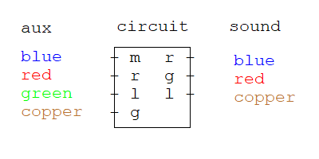

# Description
Purpose of the project was to learn how to `refactor` code multiple times, make it modular, readable, testable and stop my endless perfectionism `addiction`.

## Real life problem
I wanted to check `all possible` combinations to rewire opened apart earphone.
* I had to connect earphones `aux` audio jack to the earphones `circuit`.
* I had to connect earphones `sound` earbuds to the earphones `circuit`.



## Optimization
I wrote a program to produce all `combinations` of wiring this wires by resoldering as few of them as possible.

for wiring settings with `4` wirings in `aux` and `3` wirings in `sound` there would be `((4! * 3!) - 1) * 2 = 286` amount of resoldering needed to try all combinations with minimum amount of soldering possible.

* `4! * 3! = 144` is amount of combinations.
* `144 - 1 = 143` is amount of transitions between combinations.
* `143 * 2 = 286` is amount of resoldering required to transition between all combinations.

multiplication by `2` accurs because of switching 2 `wires` with places.

### Without optimization
In unoptimized version for the same input of `4` and `3` wirings `106` more resoldering was needed to transition between all combinations `286 + 106 = 392`.

That is because the maximum of `wire` switching (resoldering) to transition between combinations was not `2` but it could go up to `6`.

# Solution
The code is very general and can work on any amount of `wires` and `joints`.

## Example
To run the program you have to use `npm start` that will run `node src/index.js` and generate output in `output/wiring.txt`.

### Wiring settings
* The program will use `wiringSettings` json object to generate wiring combinations.
* wiringSettings type `Record<string, <Record<string, string>>`
* The object contains all the `wirings` (aux, sound) that are needed to be connected to the circuit.
* Each `wiring` contains key-value pair of `wire` and `joint` that can be soldered together.

`src/index.js`
```js
const wiringSettings = {
    aux: { m: "blue", r: "red", l: "green", g: "copper" },
    sound: { r: "red", g: "copper", l: "green" }
}
```

`output/wiring.txt:`
```
#1:
  aux:
    m - blue
    r - red
    l - green
    g - copper
  sound:
    r - red
    g - copper -> green
    l - green -> copper
#2:
  aux:
    m - blue
    r - red
    l - green
    g - copper
  sound:
    r - red -> copper
    g - green
    l - copper -> red
... (142 more combinations)
```
